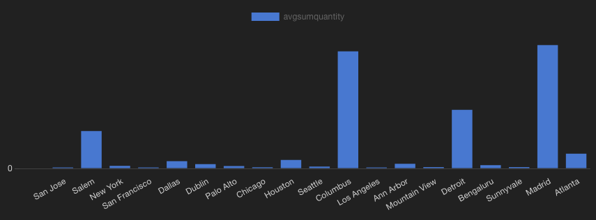
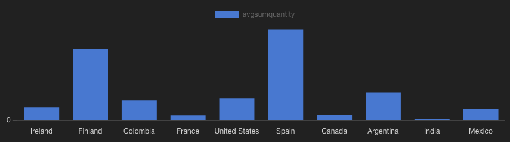

Answer the following questions and provide the SQL queries used to find the answer.

### Initial notes:
- All currency codes (currrencycode) are in USD, so no monetary values need conversion
    
**Question 1: Which cities and countries have the highest level of transaction revenues on the site?**


SQL Queries:
```SQL
SELECT country,
	city,
	sum(transactionrevenue) AS transactRevTotal
	FROM all_sessions_clean
	GROUP BY rollup(country, city) HAVING sum(transactionrevenue) IS NOT NULL
ORDER BY country, city
```
```SQL
SELECT country,
	city,
	sum(totaltransactionrevenue) AS transactRevTotal
	FROM all_sessions_clean
	GROUP BY rollup(country, city) HAVING sum(totaltransactionrevenue) IS NOT NULL
ORDER BY country, city
```


Answer:
Using 'transactionRevenue' the only country with any transaction revenue recorded in the dataset is the United States, with a transaction revenue of $2390.95. The only named city with recorded transaction revenue is Sunnyvale, with a total of $200. All other cities in which a transaction occured are 'not available in dataset'.

Using 'totaltransactionrevenue' gives more values, of which the highest city revenue is San Francisco ($1564.32) and the highest country revenue is still the United States ($13154.17).


**Question 2: What is the average number of products ordered from visitors in each city and country?**


SQL Queries:
### For country:
```SQL
SELECT 
	country,
	AVG(SumQuantity) AS AvgSumQuantity
FROM (SELECT
	 	country,
	  	visitid,
	  	SUM(productquantity) AS SumQuantity
	  FROM all_sessions_clean
	  GROUP BY country, visitid
	 ) AS T
GROUP BY country;
```
### For city:
```SQL
SELECT 
	city,
	AVG(SumQuantity) AS AvgSumQuantity
FROM (SELECT
	 	city,
	  	visitid,
	  	SUM(productquantity) AS SumQuantity
	  FROM all_sessions_clean
	  GROUP BY city, visitid
	 ) AS T
GROUP BY city;
```

Answer:
The top 5 cities are:
  1. Madrid(0.526)
  2. Columbus(0.5)
  3. Detroit(0.25)
  4. Salem(0.16)
  5. Atlanta(0.063)

The relative relationship between these values and other cities with at least 1 order can be seen in this visual:


The top 3 countries are:
  1. Spain(0.085)
  2. Finland(0.067)
  3. Argentina(0.026)

The relative relationship between these values and other countries with at least 1 order can be seen in this visual:


**Question 3: Is there any pattern in the types (product categories) of products ordered from visitors in each city and country?**


SQL Queries:
### For category counts per country
```SQL
SELECT
	country,
	v2productcategory,
	COUNT(v2productcategory) AS count
FROM all_sessions_clean
WHERE transactions is not null
GROUP BY country, v2productcategory
ORDER BY country, count DESC
```
### For order counts per country
```SQL
WITH T AS (
SELECT
	country,
	v2productcategory,
	COUNT(v2productcategory) AS count
FROM all_sessions_clean
WHERE transactions is not null
GROUP BY country, v2productcategory
ORDER BY country, count DESC
	 )
SELECT country, SUM(count)
FROM T
GROUP BY country
```
Note: This can be simplified to a count of transactions grouped by country
### For finding counts of categories containing 'Apparel'
```SQL
WITH T AS (
SELECT
	country,
	v2productcategory,
	COUNT(v2productcategory) AS count
FROM all_sessions_clean
WHERE transactions is not null
GROUP BY country, v2productcategory
ORDER BY country, count DESC
	 )
SELECT country, SUM(count)
FROM T
WHERE v2productcategory LIKE('%Apparel%')
GROUP BY country
```
### For category counts per city
```SQL
SELECT
	city,
	v2productcategory,
	COUNT(v2productcategory) AS count
FROM all_sessions_clean
WHERE transactions is not null
GROUP BY city, v2productcategory
ORDER BY city, count DESC
```

Answer:
The four countries outside of the United States that have placed orders each have at most 2 orders, which is not enough to discern a pattern. The United States has 76 orders, of which the Nest products *Nest-USA* and *Home/Nest/Nest-USA/* (making an assumption they are meant to be the same category) make up 25, *Apparel* account for 23, and an assortment of less significant categories make up the remaining 28.

**Question 4: What is the top-selling product from each city/country? Can we find any pattern worthy of noting in the products sold?**


SQL Queries:
### For country:
```SQL
SELECT 
	country,
	v2productname,
	COUNT(v2productname) AS count
FROM all_sessions_clean
WHERE transactions 
	IS NOT null
GROUP BY country, v2productname
ORDER BY country, count DESC
```
### For city:
```SQL
SELECT 
	city,
	v2productname,
	COUNT(v2productname) AS count
FROM all_sessions_clean
WHERE transactions 
	IS NOT null
GROUP BY city, v2productname
ORDER BY city, count DESC
```

Answer:
Of the five countries with orders placed, four have not sold more than one of any product. The fifth is the United States, which ranks its product sales as:
  1. "Nest® Learning Thermostat 3rd Gen-USA - Stainless Steel"
  2. "Nest® Cam Outdoor Security Camera - USA"
  3. "Nest® Cam Indoor Security Camera - USA"
  3. "Nest® Learning Thermostat 3rd Gen-USA"
The sales of each were respectively (7,5,3,3).

There is no city that has sold more than one of any product.


**Question 5: Can we summarize the impact of revenue generated from each city/country?**

SQL Queries:
*See question 1*
Answer:
Reusing the results from the query with 'totaltransactionrevenue' used in question 1, we can see from our rollup that 92% ($13`154 of $14'281) of total revenue comes from the United States. 

The revenue provided by cities appears to be normally distributed, but a better summary would be obtained from statistical tests in python or R.


